# Staging Edge Cache Validation - Implementation Complete

## 🎯 **Deployment Validation System**

### ✅ **Validation Script**: `scripts/validate_edge_cache.sh`
**Comprehensive 5-step validation process:**

1. **First Anonymous Request** → Expects CF-Cache-Status: MISS/EXPIRED/DYNAMIC
   - Validates `s-maxage=30` cache directive
   - Confirms `Vary: Authorization` header presence

2. **Second Anonymous Request** → Expects CF-Cache-Status: HIT
   - Verifies cache hit within 30-second TTL window
   - 2-second delay to ensure cache propagation

3. **Authenticated Request** → Expects cache bypass with `no-store`
   - Uses `Authorization: Bearer` header
   - Validates private caching behavior

4. **Query Parameter Separation** → Different cache entries for different params
   - Tests `size=20` vs `size=21` parameter isolation
   - Ensures proper cache key generation

5. **Query Parameter Cache Hit** → Validates separate cache entry hit
   - Confirms query-specific cache entries work correctly

### ✅ **CI/CD Workflow**: `.github/workflows/staging-validate.yml`
**Automated validation pipeline:**

- **Trigger**: Runs after successful "Staging Deploy" workflow
- **Manual Trigger**: Supports `workflow_dispatch` for on-demand validation
- **Environment**: Configurable via GitHub secrets
  - `STAGING_DOMAIN`: Your staging domain (e.g., `staging.asora.app`)
  - `STAGING_SMOKE_TOKEN`: Test authentication token
- **Failure Handling**: CI job fails if any validation step fails

### ✅ **Telemetry Sampling**: Already Implemented ✓
**Current Worker implementation:**
```typescript
const sampleRate = 0.2; // 20% of requests (80% volume reduction)
const shouldSample = Math.random() < sampleRate;

if (shouldSample && env.TELEMETRY_ENDPOINT && env.TELEMETRY_SECRET) {
  // Send telemetry beacon
}
```

## 🔧 **Configuration Requirements**

### GitHub Secrets Setup:
```bash
# Required secrets in your GitHub repository
STAGING_DOMAIN=staging.asora.app
STAGING_SMOKE_TOKEN=your-test-bearer-token
```

### Local Testing:
```bash
# Test validation script locally
DOMAIN="your-staging-domain.com" ./scripts/validate_edge_cache.sh

# Test with custom parameters
DOMAIN="staging.asora.app" \
QS1="page=1&size=20" \
QS2="page=1&size=21" \
AUTH_HDR="Authorization: Bearer your-token" \
./scripts/validate_edge_cache.sh
```

## 📊 **Expected Validation Flow**

```mermaid
graph TD
    A[Anonymous Request 1] --> B[CF-Cache-Status: MISS]
    B --> C[Cache-Control: s-maxage=30]
    C --> D[Anonymous Request 2]
    D --> E[CF-Cache-Status: HIT]
    E --> F[Authenticated Request]
    F --> G[CF-Cache-Status: BYPASS/DYNAMIC]
    G --> H[Cache-Control: no-store]
    H --> I[Different Query Params]
    I --> J[CF-Cache-Status: MISS]
    J --> K[Query Cache Hit]
    K --> L[VALIDATION PASSED ✅]
```



## 🚀 **Deployment Workflow**

1. **Deploy Cloudflare Worker to Staging**:
   ```bash
   cd infra/cloudflare
   npm run deploy:dev
   ```

2. **Trigger Staging Deployment**: Push to staging branch or merge to main

3. **Automatic Validation**: CI workflow runs validation automatically

4. **Manual Validation**: Run `workflow_dispatch` from GitHub Actions UI

5. **Production Deployment**: After validation passes
   ```bash
   npm run deploy:prod
   ```

## 🛡️ **Quality Assurance**

- ✅ **Cache Behavior**: MISS → HIT progression validation
- ✅ **Authentication**: Proper bypass for authenticated requests
- ✅ **Query Separation**: Independent cache entries per query params
- ✅ **Header Validation**: Correct Cache-Control and Vary headers
- ✅ **Error Handling**: Fails fast with descriptive error messages
- ✅ **CI Integration**: Automated validation in deployment pipeline

## 📈 **Performance Impact**

- **80% Telemetry Reduction**: 20% sampling rate dramatically reduces beacon traffic
- **30-Second Edge Cache**: Significant performance improvement for anonymous users
- **Zero Latency for Auth Users**: Authenticated requests bypass cache for data freshness
- **Query-Aware Caching**: Proper separation prevents cache pollution

This validation system ensures your edge caching implementation works correctly across all scenarios before production deployment, providing confidence in your caching strategy while maintaining data security and performance optimization.
