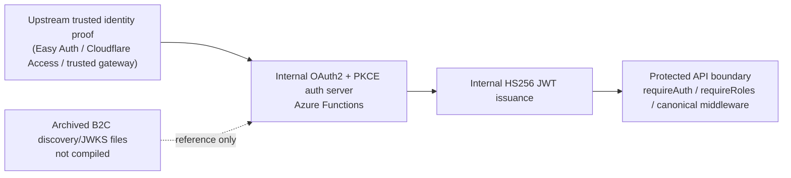

# Auth Architecture

> Status: active
> Lythaus uses upstream trusted identity proof plus internal OAuth2/PKCE and internal JWT issuance.

## Overview

Lythaus uses a custom OAuth2 authorization server running on Azure Functions. The Flutter
client authenticates via the standard Authorization Code flow with PKCE (S256). Tokens are
HS256 JWTs signed with a shared `JWT_SECRET` stored in Azure Key Vault.

```
┌─────────────┐       ┌──────────────────────────────────────┐
│ Flutter App  │◄─────►│ asora-function-flex (Azure Functions) │
│ (AppAuth)    │       │                                      │
│              │       │  /api/auth/authorize  → auth code    │
│              │       │  /api/auth/token      → JWT tokens   │
│              │       │  /api/auth/userinfo   → user profile │
│              │       │  /api/*               → protected    │
└─────────────┘       └──────────────────────────────────────┘
                              │                    │
                         Cosmos DB            PostgreSQL
                        (auth_sessions,      (refresh_tokens)
                         users)
```

> Source of truth: the diagram and file-status map below supersede earlier sketches.

## Source of Truth



| Artifact | Status | Notes |
|---|---|---|
| `docs/AUTH_ARCHITECTURE.md` | active | Canonical auth source of truth |
| `docs/web/WEB_ARCHITECTURE.md` | active | Web-specific view that points back here |
| `functions/README.md` | active | Runtime guide with a legacy compatibility section |
| `docs/rebrand/REFERENCE_MAP.md` | compatibility | Brand map includes auth compatibility notes |
| `docs/branding/lythaus-transition.md` | active | Branding guide; auth references defer here |
| `docs/web/WEB_ARCHITECTURE_DECISIONS.md` | deprecated | Historical ADRs only |
| `functions/src/auth/routes/{authorize,token,userinfo,ping,invite_validate}.ts` | active | Current auth route handlers |
| `functions/src/auth/b2cOpenIdConfig.ts.archived` | archived | Not compiled |
| `functions/src/auth/jwks.ts.archived` | archived | Not compiled |

## Token Flow

### 1. Authorization (`/api/auth/authorize`)

- **File**: `functions/src/auth/service/authorizeService.ts`
- Client sends an OAuth2 authorization request with PKCE parameters
- Server validates: `response_type=code`, `code_challenge_method=S256`, PKCE challenge
  (43–128 chars, base64url)
- User identity is established from upstream trusted identity proof:
  - `x-ms-client-principal-id` (Azure Easy Auth / Cloudflare Access)
  - `x-authenticated-user-id` (custom proxy)
- Generates a random authorization code (32 bytes, base64url)
- Stores session in Cosmos `auth_sessions` container (partition key: `clientId`)
- Returns `302 redirect` with `?code=...&state=...`
- **Auth code TTL**: 10 minutes

### 2. Token Exchange (`/api/auth/token`)

- **File**: `functions/src/auth/service/tokenService.ts`
- Grant types: `authorization_code`, `refresh_token`
- **Authorization code grant**:
  - Validates PKCE `code_verifier` against stored `code_challenge` (SHA-256)
  - Issues access token (HS256, 15 min) and refresh token (HS256, 7 days)
  - Marks auth session as `used` (one-time use)
- **Refresh token grant**:
  - Validates refresh token signature and expiry
  - Rotates refresh token atomically via PostgreSQL transaction
  - Returns new access + refresh token pair

Access-token endpoints only accept `type=access`; refresh-token handling only accepts
`type=refresh`.
- **Token payload**:
  ```json
  {
    "sub": "<user-id>",
    "iss": "asora-auth",
    "email": "...",
    "name": "...",
    "tier": "...",
    "roles": ["..."],
    "scp": "read write"
  }
  ```

The API middleware accepts both `role` and `roles` claims from issued JWTs and normalizes them
into the `roles` array used by route guards.

### 3. Token Verification (API middleware)

- **File**: `functions/src/auth/verifyJwt.ts`
- Verifies `Authorization: Bearer <token>` headers
- Algorithm: **HS256** (symmetric, using `JWT_SECRET`)
- Checks: allowed algorithm (HS256), issuer (`asora-auth`), optional audience, expiry, not-before, token type, and internal `sub`
- `sub` must resolve to a valid internal user ID; active-user and role checks are enforced in canonical middleware/guards
- Extracts `Principal` with `sub`, `email`, `name`, `tier`, `scp`, `roles`
- Used by `requireAuth()`, `requireRoles()`, `requireAdmin()`, etc.

### 4. User Info (`/api/auth/userinfo`)

- Protected endpoint returning current user profile
- Uses `requireAuth` middleware to validate token

## Refresh Token Security

- **Storage**: PostgreSQL `refresh_tokens` table (NOT Cosmos)
- **Rotation**: Each refresh creates a new token and deletes the old one atomically
  (`BEGIN → DELETE → INSERT → COMMIT`)
- **Cleanup**: Expired tokens cleaned on store operations
- **File**: `functions/src/auth/service/refreshTokenStore.ts`

## Client-Side (Flutter)

- **File**: `lib/features/auth/application/oauth2_service.dart`
- Uses `flutter_appauth` for native OAuth2 flow
- PKCE enforced automatically by AppAuth (S256)
- Tokens stored in `flutter_secure_storage` (hardware-backed keychain)
- Keys: `oauth2_access_token`, `oauth2_refresh_token`, `oauth2_id_token`,
  `oauth2_token_expiry`, `oauth2_user_data`
- Auto-refresh: triggers 30 seconds before expiry
- Platform redirect URIs:
  - Android: `com.asora.app://oauth/callback`
  - iOS/macOS: `asora://oauth/callback`
  - Linux/Windows: `http://localhost:8080/oauth/callback`
  - Web: `{origin}/auth/callback`

## Identity Providers

The auth choice screen offers three social providers and guest access. The provider hints
are compatibility metadata only:

| Provider | IdP Hint | Status |
|----------|----------|--------|
| Google   | `Google` | Listed — compatibility hint consumed by the upstream trusted identity layer |
| Apple    | `Apple`  | Listed — compatibility hint consumed by the upstream trusted identity layer |
| World ID | `World`  | Listed — compatibility hint consumed by the upstream trusted identity layer |
| Guest    | —        | Works (no authentication) |

**How IdP hints work**: The Flutter client passes `idp=Google` (etc.) as an additional
query parameter to `/api/auth/authorize`. Currently the authorize endpoint does not
process this parameter — it relies on an upstream authentication proxy (Cloudflare Access)
to handle social login and inject user identity headers. IdPs will be functional once
Cloudflare Access is enabled on the admin surface, and the auth server consumes trusted
identity proof from upstream when it is present.

Compatibility note: the `idp=` hints are not the auth boundary. The active boundary is
upstream trusted identity proof plus internal OAuth2/PKCE and internal JWT issuance.

## Admin Auth (Cloudflare Access)

- **File**: `functions/src/admin/accessAuth.ts`
- Separate auth path for the admin control panel
- Verifies Cloudflare Access JWTs (RS256 via CF JWKS endpoint)
- Requires `CF_ACCESS_TEAM_NAME` env var to be set
- **Status**: Live (Cloudflare Access is enabled on the admin surface)

## Trust Boundaries

| Boundary | Surface | Guard | State |
|---|---|---|---|
| Public | Auth start, guest entry, public marketing/legal pages | No user JWT required | Live |
| Authenticated | User profile, posts, feeds, notifications | `requireAuth` / bearer JWT | Live |
| Admin | Control panel and `/_admin/*` endpoints | Cloudflare Access + admin role | Live |
| Web session auth | Browser tab session storage and callback flow | `WebAuthService` + PKCE | Live |
| Legacy compatibility auth config | none | Removed; client config now comes from the supported auth paths | Removed |

Public and authenticated user traffic never traverse the admin auth path.
The admin path is intentionally isolated so admin access can be enabled
independently of the user auth flow.

## Environment Variables

### Required

| Variable | Set On | Source | Purpose |
|----------|--------|--------|---------|
| `JWT_SECRET` | flex, dev | Key Vault (`kv-asora-flex-dev/jwt-secret`) | HS256 signing key for custom OAuth2 tokens |

### Optional

| Variable | Default | Purpose |
|----------|---------|---------|
| `JWT_ISSUER` | `asora-auth` | Token issuer claim |
| `JWT_AUDIENCE` | _(none — skip check)_ | Expected audience (comma-separated for multiple) |
| `AUTH_MAX_SKEW_SECONDS` | `120` | Clock skew tolerance |
| `AUTH_ALLOW_TEST_USER_ID` | `false` | Allow `user_id` query param in authorize (testing only) |

### Removed Compatibility Config

Legacy compatibility auth config has been removed. The active auth flow uses the
supported OAuth2 endpoints and build-time client configuration described above.

## Cosmos Containers

### `auth_sessions`

- **Partition key**: `/partitionKey` (= `clientId`)
- **Composite indexes**:
  - `(authorizationCode ASC, clientId ASC)` — token exchange lookup
  - `(clientId ASC, createdAt DESC)` — session listing

### `users`

- **Partition key**: `/id`
- Queried as `users.item(userId, userId)` — point read by partition key

## Security Checklist

- [x] PKCE S256 enforced (server rejects plain, validates challenge format)
- [x] Auth code single-use (marked `used` after exchange)
- [x] Auth code TTL 10 minutes
- [x] Access token TTL 15 minutes
- [x] Refresh token TTL 7 days with atomic rotation
- [x] HS256 JWT with 48-byte random secret from Key Vault
- [x] Clock skew tolerance 120 seconds
- [x] Tokens stored in hardware-backed secure storage (Flutter)
- [x] State parameter required and validated
- [x] Redirect URI validated (URL parsing)
- [ ] Rate limiting on token endpoint (not yet implemented)
- [x] Upstream trusted identity proof (Azure Easy Auth / Cloudflare Access headers) is accepted by the auth server

## File Map

| File | Purpose |
|------|---------|
| `functions/src/auth/service/authorizeService.ts` | OAuth2 authorize endpoint |
| `functions/src/auth/service/tokenService.ts` | Token exchange (auth code + refresh) |
| `functions/src/auth/service/refreshTokenStore.ts` | Postgres refresh token rotation |
| `functions/src/auth/verifyJwt.ts` | HS256 JWT verification middleware |
| `functions/src/auth/config.ts` | Auth configuration (JWT_SECRET, issuer) |
| `functions/src/auth/requireAuth.ts` | Express-style auth guard |
| `functions/src/auth/requireRoles.ts` | Role-based authorization guard |
| `functions/src/auth/types.ts` | AuthSession, TokenPayload types |
| `functions/src/admin/accessAuth.ts` | Cloudflare Access JWT verification (admin) |
| `lib/features/auth/application/oauth2_service.dart` | Flutter OAuth2 client |
| `lib/features/auth/presentation/auth_choice_screen.dart` | Login UI |
| `lib/features/auth/presentation/auth_gate.dart` | Navigation auth gate |

## Archived

These files are archived (`.ts.archived`) for reference. They implemented Azure B2C
OIDC discovery and JWKS verification. They are excluded from compilation because
`functions/tsconfig.json` only includes `src/**/*.ts`:

- `functions/src/auth/b2cOpenIdConfig.ts.archived`
- `functions/src/auth/jwks.ts.archived`
