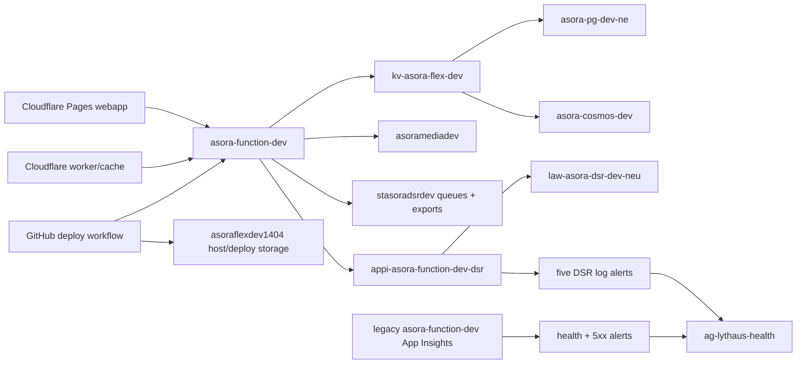

# Lythaus Wave 0 Azure Cost Optimization Plan

**Date:** 2026-07-12
**Subscription:** Azure subscription 1 (`99df7ef7-776a-4235-84a4-c77899b2bb04`)
**Scope:** Lythaus (formerly Asora) Wave 0 webapp/API, DSR, auth, feed, moderation, storage, monitoring, and deployment
**Change status:** Initial audit was read-only. After explicit approval, AZ-COST-01 and AZ-COST-02 were implemented on 2026-07-12. AZ-COST-04 produced repo-only design work; no live DSR alert consolidation was applied.

## Implementation update

- **AZ-COST-01 complete:** `alert-asora-function-dev-health-fail` and `alert-asora-function-dev-5xx-rate` are disabled. Both remain scoped to the inactive legacy `asora-function-dev` App Insights component and can be re-enabled without recreating them.
- **AZ-COST-02 complete:** blob soft delete is enabled for seven days on `asoraflexdev1404`. The only new lifecycle rule is `delete-old-function-deployments`, scoped to block blobs under `deployments/`, deleting after 30 days.
- **AZ-COST-04 design complete:** the safe equivalent topology is five rules to three, not five to two, because Azure severity is set per alert rule. See [DSR alert consolidation design](./2026-07-12-dsr-alert-consolidation-design.md).
- **No protected runtime changes:** PostgreSQL remains running on `Standard_B1ms`; `function:privacyDsrProcessor=1`, 2,048 MB Function memory, and all DSR queue/storage settings are unchanged.
- **Validation issue discovered:** fresh DSR telemetry reports main queue depth `0`, poison queue depth `2`, `poisonQueueExists=true`, and two persisted failed requests. No new `dsr.queue.failed` traces appeared in the prior 24 hours. The five DSR rules remain enabled, but Alerts Management did not show active poison/failure alert instances even though both live KQL queries evaluated true. Live consolidation is blocked until that monitoring defect is resolved.

## Executive summary

- Azure Cost Management reports **$15.68 actual through 2026-07-12** and a **$35.55 July forecast**.
- The forecast materially understates the current steady state because `function:privacyDsrProcessor=1` and five DSR log alerts began billing on 2026-07-05. Complete billing days from 2026-07-06 through 2026-07-11 normalize to approximately **$59.25 per 31-day month**.
- Current steady-state drivers are the active Function App (**$23.41/month**), PostgreSQL (**$19.11/month**), seven five-minute log alerts (**$11.57/month**), and Function host/deployment storage (**$4.80/month**).
- PostgreSQL is already `Standard_B1ms`, 32 GB P4, seven-day backup retention, HA off. It is active and used by auth/admin. It cannot be safely downsized further.
- Cosmos DB is serverless and active. It normalizes to only **$0.20/month** and is required by feed, auth, moderation, and DSR.
- Log Analytics ingestion and retention currently bill **$0**. The active workspace uses 30-day retention and ingested about 3.0 GB over 30 days. Reducing retention or sampling would not reduce the current bill and could damage DSR evidence.
- The active Function App is correctly configured with one always-ready instance only for `function:privacyDsrProcessor`. Removing it is not recommended. Directly moving the whole app to the 512 MB Flex tier is unsafe: peak working set reached about **1.21 GB**.
- Two general log alerts cost about **$3.30/month** but target the inactive legacy `asora-function-dev` Application Insights component, which has no requests, traces, or exceptions in the last 30 days.
- Five DSR alerts are enabled and correctly target `appi-asora-function-dev-dsr`. They must remain until the current poison/failure alert-engine discrepancy is resolved and an equivalent five-minute replacement is validated.
- AZ-COST-01 and AZ-COST-02 should save approximately **$3.40/month**. The safe severity-preserving three-rule consolidation design can later add about **$3.30/month**. A later isolated 512 MB DSR worker could save about **$17.56/month**, but it is a high-risk engineering project, not a quick change.

## Current cost

| Measure | USD |
|---|---:|
| Actual, July 1-12 | $15.68 |
| Azure July forecast | $35.55 |
| Normalized current 31-day run rate | $59.25 |

The normalized run rate uses six complete billing days after the July 5 DSR guard/alert activation. It is a planning estimate, not an Azure forecast.

### Cost drivers

| Driver | July actual | Normalized 31-day | Evidence |
|---|---:|---:|---|
| `asora-function-dev` | $4.84 | $23.41 | Nearly all cost is Flex **Always Ready Baseline**; on-demand execution billed $0 |
| `asora-pg-dev-ne` | $6.51 | $19.11 | B1ms compute plus P4 storage; active connections and auth/admin code dependency |
| Seven scheduled-query alerts | $2.78 | $11.57 | All evaluate every five minutes |
| `asoraflexdev1404` | $1.44 | $4.80 | 5.47 GiB, 3.04M transactions/30d; active host and deployment storage |
| `asora-cosmos-dev` | $0.05 | $0.20 | Serverless; 5.27M requests and 307,651 RU/30d |
| `stasoradsrdev` | $0.05 | $0.14 | Active DSR queue/export account; 288,646 transactions/30d |
| Key Vaults | $0.01 | $0.03 | Active and legacy secret-reference operations |
| Log Analytics/App Insights ingestion | $0.00 | $0.00 observed | Active workspace below current billed threshold |

## Resource inventory

Categories:

- **A:** Keep as-is for Wave 0 safety
- **B:** Keep, but optimize only after approval
- **C:** Stop temporarily after approval and observe
- **D:** Delete only after export/backup and approval
- **E:** Defer because a dependency remains unclear or must be migrated first
- **F:** Beta/prod/mobile/later or legacy resource, not needed by Wave 0

`Jul` is observed July 1-12 cost. `Norm` is the normalized monthly cost where a stable billed run rate is available.

| Resource | Type / region / SKU | Jul | Norm | Dependency and activity evidence | Wave 0 | Class |
|---|---|---:|---:|---|---|:---:|
| `asora-pg-dev-ne` | PostgreSQL Flexible / NEU / B1ms, P4 32 GB | $6.51 | $19.11 | Key Vault-backed active setting; auth/admin PostgreSQL clients; avg 6.3 connections, 11.2% CPU, 45.6% peak | Required | A |
| `vnet-asora-dev` | VNet / NEU | $0 | $0 | Delegated PostgreSQL subnet with one IP configuration and one private endpoint | Required | A |
| `mi-asora-cicd` | User-assigned identity / NEU | $0 | $0 | No federated credentials or role assignments; no direct repo reference | No evidence | D |
| `kv-asora-flex-dev` | Key Vault / NEU | $0.006 | $0.02 | Eight active Function Key Vault references, including Cosmos/PostgreSQL/auth dependencies | Required | A |
| `appi-asora-dev` | App Insights / NEU | $0 | $0 | No 30-day telemetry; old feed workbooks reference it; linked to default workspace | No active use | E |
| `kv-asora-dev` | Key Vault / NEU | $0.002 | $0.01 | Referenced by idle `asora-function-flex`; not referenced by active Wave 0 app | Legacy | F |
| `asora-function-dev` | Legacy App Insights component / NEU | $0 | $0 | No 30-day telemetry; stale Function hidden-link and two live alert scopes depend on it | No active ingest | E |
| `asorapsqlflex8fa9` | StorageV2 / NEU / Standard LRS Hot | $0.0001 | ~$0 | 18 MiB legacy package/host artifacts; current host/deployment storage points elsewhere | No current runtime use | D |
| `asora-function-dev` | Function App / NEU / Node 22 Flex | $4.84 | $23.41 | Active API, Cloudflare origin, workflow target; 96,605 executions/31d; `privacyDsrProcessor=1` only | Required | A |
| `asoraflexdev1404` | StorageV2 / NEU / Standard LRS Hot | $1.44 | $4.80 | Active Function host and deployment storage; also used by two legacy apps; 5.47 GiB and 3.04M tx/30d | Required | B |
| `asora-cosmos-dev` | Cosmos DB / NEU / serverless | $0.05 | $0.20 | 32 containers; active feed/auth/moderation/DSR clients; 5.27M requests/30d | Required | A |
| `ASP-asorapsqlflex-4a5f` | Flex Consumption plan / NEU / FC1 | $0 | $0 | Hosts idle `asora-function-flex` | Later/legacy | F |
| `asora-function-flex` | Function App / NEU / Node 20 Flex | $0 | $0 | Zero executions/30d; mobile OAuth/docs and alert IaC references; shares host storage and both vaults | Not Wave 0 | C |
| `asora-function-flex` | App Insights / NEU | $0 | $0 | No 30-day telemetry; linked to default workspace | Later/legacy | F |
| `asora-function-consumption` | Function App / NEU / Consumption | $0 | $0 | One execution/30d; retirement workflow/docs only; shares host storage | Not Wave 0 | C |
| `asora-function-consumption` | App Insights / NEU | $0 | $0 | No 30-day telemetry; linked to default workspace | Legacy | F |
| `NorthEuropeLinuxDynamicPlan` | Consumption plan / NEU / Y1 | $0 | $0 | Hosts legacy consumption app | Legacy | F |
| `asora-flex-plan-new` | Flex Consumption plan / NEU / FC1 | $0 plan line | Included in Function | Hosts active `asora-function-dev` | Required | A |
| `asoramediadev` | StorageV2 / NEU / Standard LRS Hot | $0 | $0 | Active `MEDIA_STORAGE_ACCOUNT`, deployment workflow, `user-media`; two transactions/30d | Required for media | A |
| `dash-lythaus-health` | Portal dashboard / NEU | $0 | $0 | Monitoring dashboard; IaC references active and legacy telemetry targets | Operational | A |
| `asora.co.za-asora-function-dev` | App Service certificate / NEU | $0 | $0 | Bound to live `asora.co.za` hostname | Bound | A |
| `dev.asora.co.za-asora-function-dev` | App Service certificate / NEU | $0 | $0 | Bound to live `dev.asora.co.za` hostname | Bound | A |
| `www.asora.co.za-asora-function-dev` | App Service certificate / NEU | $0 | $0 | Bound to live `www.asora.co.za` hostname | Bound | A |
| `alert-asora-function-dev-health-fail` | Log alert / NEU / 5m | $0.56 | $1.65 | Reads inactive legacy App Insights; no 30-day source data | Ineffective | B |
| `alert-asora-function-dev-5xx-rate` | Log alert / NEU / 5m | $0.56 | $1.65 | Reads inactive legacy App Insights; no 30-day source data | Ineffective | B |
| `alert-asora-function-dev-dsr-stuck-queued` | Log alert / NEU / 5m | $0.33 | $1.65 | Active DSR trace scope; required signal | Required | B |
| `alert-asora-function-dev-dsr-queue-depth` | Log alert / NEU / 5m | $0.33 | $1.65 | Active DSR trace scope; required signal | Required | B |
| `alert-asora-function-dev-dsr-failures` | Log alert / NEU / 5m | $0.34 | $1.67 | Active DSR trace scope; required signal | Required | B |
| `alert-asora-function-dev-dsr-poison-queue` | Log alert / NEU / 5m | $0.33 | $1.66 | Active DSR trace scope; critical signal | Required | B |
| `alert-asora-function-dev-dsr-missing-completion` | Log alert / NEU / 5m | $0.33 | $1.64 | Active DSR trace scope; required signal | Required | B |
| `appi-asora-function-dev-dsr` | App Insights / NEU | $0 | $0 billed | Active Function telemetry target; 135 request records and 8,269 traces/30d | Required | A |
| `law-asora-dsr-dev-neu` | Log Analytics / NEU / PerGB2018, 30d | $0 | $0 observed | Active DSR workspace; about 3.0 GB ingestion/30d | Required | A |
| `stasoradsrdev` | StorageV2 / East US / Standard LRS Hot | $0.05 | $0.14 | DSR queue/export binding, four queues, export container, workflow/docs; 288,646 tx/30d | Required | A |
| `ag-lythaus-health` | Action group / NEU | $0 | $0 | Email receiver for all seven alerts | Required | A |
| `Application Insights Smart Detection` | Action group / NEU | $0 | $0 | No email/webhook receivers; auto-created legacy dependency unclear | No Wave 0 evidence | E |
| `DefaultWorkspace-99df7ef7-776a-4235-84a4-c77899b2bb04-NEU` | Log Analytics / NEU | $0 observed | $0 observed | Hosts four inactive App Insights components; delete only after component migration/deletion | No active telemetry | D |
| `NetworkWatcher_northeurope` | Network Watcher / NEU | $0 | $0 | Auto-created network diagnostic resource; no billed line | Platform support | E |

### Tags

- PostgreSQL and Cosmos carry legacy `Asora-Mobile`, `Development`, `PII`, project, department, cost-centre, region, and SLA tags. The names/tags are stale branding metadata, but changing them has no cost benefit and is outside this task.
- `asoramediadev` is tagged `product=lythaus`, `environment=dev`, `purpose=media-storage`.
- The active Function App has a stale hidden link to the inactive `asora-function-dev` App Insights component even though its live connection setting targets `appi-asora-function-dev-dsr`.
- Most other resources have no tags.

## Dependency map



## Runtime findings

- `/api/health`, `/api/ready`, and `/api/feed/discover` returned HTTP 200 during the audit.
- The Wave 0 web origin is `https://lythaus-web.pages.dev`; `beta.lythaus.co.za` does not resolve and is not the configured release URL.
- `asora-function-dev` is running Node 22, 2,048 MB, maximum 100 instances, with exactly one always-ready instance named `function:privacyDsrProcessor`.
- Working set averaged about 569 MB and peaked at about 1.21 GB; CPU averaged about 1.0% and peaked at 3% over the stable six-day window.
- Microsoft currently offers Flex sizes of 512, 2,048, and 4,096 MB. The whole app cannot safely move to 512 MB based on observed peak memory.
- DSR queue/export settings consistently target `stasoradsrdev`. DSR diagnostic settings are not enabled. The export container is currently empty.
- Azure CLI confirmed all four DSR queues exist but did not expose approximate counts through identity auth. Message bodies were deliberately not peeked.
- PostgreSQL is active despite `docs/runbooks/azure-retirement-2026.md` saying no active PostgreSQL IaC exists. Live runtime settings, code, and metrics take precedence.
- Cosmos is serverless, single-region, continuous-backup, and heavily used. Provisioned-RU savings do not apply.
- `asoraflexdev1404` contains 204 blobs totaling about 5.55 GiB in `deployments`; stored-data cost is only about $0.10/month. Operations, not capacity, dominate its bill.
- `stasoradsrdev` already had `dsr-export-lifecycle` since 2025, scoped to `dsr-exports/` with 30-day base-blob and snapshot deletion. AZ-COST-02 did not modify that account or rule.
- `asoraflexdev1404` now has one separate lifecycle rule scoped only to `deployments/`; runtime host containers are excluded.
- The current `infrastructure/alerts` Terraform defaults are unsafe to apply blindly: they include the legacy `asora-function-flex` target and additional auth/DSR rules not present live. A targeted plan and state reconciliation are required first.

## Safe quick wins

### 1. Disable two ineffective general log alerts

**Resources:** `alert-asora-function-dev-health-fail`, `alert-asora-function-dev-5xx-rate`
**Expected saving:** approximately **$3.30/month** steady state
**Risk:** low-medium
**Why:** both rules target an App Insights component with zero requests, traces, and exceptions in 30 days. They currently provide no active Wave 0 signal.
**Downtime:** none
**Data loss:** none
**Backup:** export rule JSON first
**Rollback:** re-enable both rules

Commands after approval:

```powershell
New-Item -ItemType Directory -Force .azure-cost-backup | Out-Null
az monitor scheduled-query show -g asora-psql-flex -n alert-asora-function-dev-health-fail -o json > .azure-cost-backup/health-fail.json
az monitor scheduled-query show -g asora-psql-flex -n alert-asora-function-dev-5xx-rate -o json > .azure-cost-backup/5xx-rate.json
az monitor scheduled-query update -g asora-psql-flex -n alert-asora-function-dev-health-fail --disabled true
az monitor scheduled-query update -g asora-psql-flex -n alert-asora-function-dev-5xx-rate --disabled true
```

Rollback:

```powershell
az monitor scheduled-query update -g asora-psql-flex -n alert-asora-function-dev-health-fail --disabled false
az monitor scheduled-query update -g asora-psql-flex -n alert-asora-function-dev-5xx-rate --disabled false
```

Post-change validation: confirm both resources report `enabled=false`; confirm all five DSR alerts remain enabled; run API and web smokes; query active App Insights for current DSR traces.

### 2. Add a 30-day lifecycle rule only to old deployment blobs

**Resource:** `asoraflexdev1404`, prefix `deployments/`
**Expected saving:** at most **$0.10/month** at current size
**Risk:** low if the latest 30 days remain; medium if rollback depends on older packages
**Downtime:** none expected
**Data loss:** yes, packages older than 30 days
**Backup:** export a blob manifest and enable seven-day blob soft delete first
**Rollback:** remove the lifecycle rule; restore soft-deleted blobs within seven days

Portal action after approval:

1. Open `asoraflexdev1404` > Data protection; enable blob soft delete for 7 days.
2. Open Lifecycle management; add enabled rule `delete-old-function-deployments`.
3. Scope to block blobs with prefix `deployments/`.
4. Delete base blobs when last modified more than 30 days ago.
5. Do not scope the rule to `azure-webjobs-hosts`, `azure-webjobs-secrets`, or the whole account.

### 3. Stop idle legacy Function Apps for a 48-hour observation

**Resources:** `asora-function-flex`, `asora-function-consumption`
**Expected saving:** **$0 direct**; possible unquantified reduction in shared host-storage operations
**Risk:** medium because `asora-function-flex` retains mobile/docs references and Key Vault dependencies
**Downtime:** complete for those two legacy endpoints
**Data loss:** none
**Backup:** export app configuration names and ARM resource JSON; never export secret values into the repo
**Rollback:** start both apps

Commands after approval:

```powershell
az functionapp stop -g asora-psql-flex -n asora-function-flex
az functionapp stop -g asora-psql-flex -n asora-function-consumption
```

Rollback:

```powershell
az functionapp start -g asora-psql-flex -n asora-function-flex
az functionapp start -g asora-psql-flex -n asora-function-consumption
```

This is cleanup/observation, not a material immediate cost reduction.

## Medium-risk optimizations

### Consolidate five DSR log alerts into three equivalent five-minute rules

The repo-only design found that two rules cannot preserve the current severity contract because poison is Sev1 while the other DSR signals are Sev2. The safe topology is:

1. Consolidated Sev2 state rule: stuck queued, queue depth, and failures, split by `Signal`.
2. Existing Sev1 poison-queue rule, unchanged.
3. Existing Sev2 missing-completion rule, unchanged.

The candidate consolidated KQL was validated read-only against live telemetry and returned `failures=2`, while correctly omitting clear queue-depth and stuck-queued signals. No Terraform or Azure rule was changed.

**Expected saving:** approximately **$3.30/month** by retiring two rules, before small dimension charges
**Risk:** medium
**Downtime:** none expected
**Data loss:** none
**Rollback:** re-enable the five existing rules
**Approval boundary:** design only is complete. Do not apply until poison/failure alert firing is proven, Terraform state is reconciled, and a second approval is granted for the exact plan.

## High-risk changes requiring explicit approval

### Isolate DSR worker into a 512 MB Flex app

An isolated app/package could retain `function:privacyDsrProcessor=1` at 512 MB while allowing the main 2,048 MB app to scale to zero. A simple memory change on the current app is not safe because peak working set is about 1.21 GB.

**Potential saving:** about **$17.56/month** on the normalized Always Ready baseline, before small new storage/telemetry costs
**Risk:** high
**Required proof:** isolated package or function-disable matrix, no double queue consumer, identity/RBAC parity, deployment pipeline, DSR cold regression, queue/poison checks, telemetry and alert parity, rollback deployment
**Approval boundary:** design/build only first; no Azure creation or cutover until a separately approved deployment plan exists.

### Stop PostgreSQL on a schedule

PostgreSQL compute represents approximately 77% of its bill. Stopping it for 12 hours/day could save roughly **$7.35/month**, but auth/admin and any PostgreSQL-backed paths would be unavailable. Azure automatically restarts a stopped Flexible Server after seven days. This is incompatible with always-on Wave 0 validation and is **not recommended**.

Commands only if explicitly approved for a defined maintenance window:

```powershell
az postgres flexible-server stop -g asora-psql-flex -n asora-pg-dev-ne
az postgres flexible-server start -g asora-psql-flex -n asora-pg-dev-ne
```

## Resources not safe to delete or scale down

- `asora-function-dev`, `asora-flex-plan-new`, and `function:privacyDsrProcessor=1`
- `asoraflexdev1404` account, Function host containers, and current deployment blobs
- `stasoradsrdev`, its DSR queues, poison queues, and `dsr-exports`
- `appi-asora-function-dev-dsr`, `law-asora-dsr-dev-neu`, five current DSR alerts, and `ag-lythaus-health` until equivalent monitoring is live
- `asora-pg-dev-ne`, `vnet-asora-dev`, `kv-asora-flex-dev`, and `asora-cosmos-dev`
- `asoramediadev`
- Bound App Service certificates

## Recommended action order

1. Approve/export/disable the two ineffective general alerts.
2. Approve the narrow `deployments/` lifecycle policy after manifest export and soft delete.
3. Measure cost and host-storage transactions for seven days.
4. Approve a repo-only DSR alert consolidation design and Terraform plan.
5. After separate plan approval, deploy replacement alerts, test all five signals, then disable the five old rules.
6. Defer legacy app/component deletion; direct savings are $0.
7. Consider isolated 512 MB DSR worker only after Wave 0 stability and dedicated regression proof.

## Estimated forecast after changes

| Scenario | Estimated monthly run rate |
|---|---:|
| Current normalized configuration | $59.25 |
| Disable two ineffective alerts + deployment lifecycle | ~$55.85 |
| Plus equivalent five-to-three DSR alert consolidation | ~$52.55 |
| Plus later isolated 512 MB DSR worker | ~$34.99 |
| PostgreSQL scheduled stop | Not included; incompatible with always-on Wave 0 |

If only the immediate low-risk items are approved, use **about $55.85/month** as the forward planning estimate, not Azure's current $35.55 July forecast.

## Post-change validation checklist

- Confirm `function:privacyDsrProcessor=1` remains configured.
- Run the DSR health check or cold regression where relevant.
- Confirm `dsr-requests` and poison queues exist; check depth without printing message bodies.
- Confirm `/api/health` returns 200.
- Confirm `/api/ready` returns 200.
- Confirm `/api/feed/discover` returns 200.
- Confirm `https://lythaus-web.pages.dev` loads.
- Run feed discover and auth smoke if their dependencies are touched.
- Query `appi-asora-function-dev-dsr` for current `privacyDsrQueueMonitor` and DSR worker traces.
- Confirm all required DSR alert rules and `ag-lythaus-health` are healthy.
- Compare Function memory, CPU, executions, and host-storage transactions before/after.
- Re-query Azure Cost Management after 48 hours and after seven complete billing days.
- Run `git status --short --branch` if repo files changed.
- Run the repository document secret scan if docs/evidence changed.

## Exact approval list

- **AZ-COST-01 — implemented:** Two ineffective general scheduled-query alerts are disabled. Expected saving: ~$3.30/month.
- **AZ-COST-02 — implemented:** Seven-day blob soft delete and a 30-day lifecycle rule scoped only to `asoraflexdev1404/deployments/` are active. Expected saving: <=$0.10/month.
- **AZ-COST-03:** Stop `asora-function-flex` and `asora-function-consumption` for a 48-hour observation. Expected direct saving: $0; optional cleanup experiment.
- **AZ-COST-04 — repo-only design complete:** The recommended severity-preserving topology consolidates five DSR alerts to three. No live DSR rule changed. Expected later saving: ~$3.30/month before small dimension charges.
- **AZ-COST-05:** Prepare a repo-only feasibility design for an isolated 512 MB DSR Function App that keeps `privacyDsrProcessor=1`. No Azure creation or cutover under this approval. Potential later saving: ~$17.56/month.

No further live cost action is authorized. DSR consolidation requires a new explicit approval after the monitoring blocker is resolved.

## Sources

- Azure live resource APIs, Cost Management Query/Forecast APIs, Azure Monitor metrics, Application Insights queries, Log Analytics usage, Function ARM configuration, and Storage data-plane metadata collected read-only on 2026-07-12.
- [Azure Functions Flex Consumption plan](https://learn.microsoft.com/en-us/azure/azure-functions/flex-consumption-plan)
- [Configure Flex instance memory and always-ready counts](https://learn.microsoft.com/en-us/azure/azure-functions/flex-consumption-how-to)
- [Azure Monitor pricing](https://azure.microsoft.com/en-us/pricing/details/monitor/)
- [Azure Monitor cost and usage](https://learn.microsoft.com/en-us/azure/azure-monitor/fundamentals/cost-usage)
- [Azure Monitor cost optimization](https://learn.microsoft.com/en-us/azure/azure-monitor/fundamentals/best-practices-cost)
- [PostgreSQL Flexible Server overview](https://learn.microsoft.com/en-us/azure/postgresql/flexible-server/service-overview)
- [Azure Blob lifecycle policy configuration](https://learn.microsoft.com/en-us/azure/storage/blobs/lifecycle-management-policy-configure)
